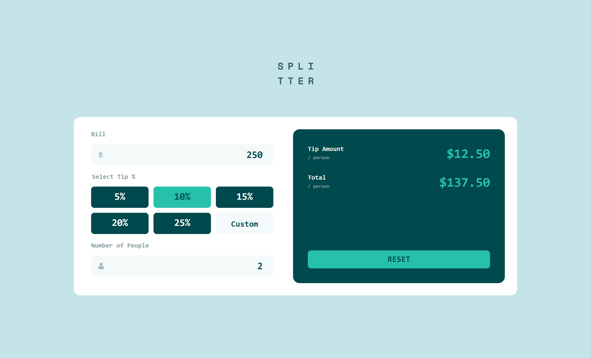
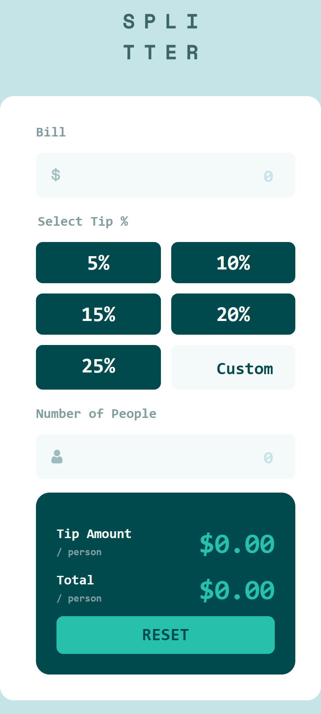

# Frontend Mentor - Tip calculator app

This is a solution to the [Tip calculator app on Frontend Mentor](https://www.frontendmentor.io/challenges/tip-calculator-app-ugJNGbJUX). Frontend Mentor challenges help you improve your coding skills by building realistic projects.

## Table of contents

- [Overview](#overview)
  - [The challenge](#the-challenge)
  - [Screenshot](#screenshot)
  - [Links](#links)
- [My process](#my-process)
  - [Built with](#built-with)
  - [What I learned](#what-i-learned)
  - [Useful resources](#useful-resources)
- [Author](#author)

## Overview

### The challenge

Users should be able to:

- Calculate the correct tip and total cost of the bill per person
- View the optimal layout for the app depending on their device's screen size
- See hover states for all interactive elements on the page

### Screenshot

| Desktop View                  | Mobile View                  |
| ----------------------------- | ---------------------------- |
|  |  |

### Links

[Live Site URL](https://kapteynuniverse.github.io/Tip-calculator-app/)

[Solution URL](https://www.frontendmentor.io/solutions/tip-calculator-a9KBsRyR6Y)

## My process

### Built with

- Semantic HTML5 markup
- CSS custom properties
- Mobile-first workflow
- CSS Grid & Flexbox
- Vanilla JavaScript

### What I learned

While building this project, I improved my understanding of:

- Structuring forms with proper semantics (`fieldset`, `legend`, labels)
- Building accessible UI components using `aria` attributes and screen-reader-only content
- Managing UI state in JavaScript using a single source of truth
- Handling user input and validation in a predictable way
- Creating custom-styled radio inputs while preserving accessibility
- Synchronizing different input methods (radio buttons vs custom input)
- Writing cleaner, more maintainable logic by separating:
  - state
  - calculation
  - rendering

### Useful resources

- [MDN - input event](https://developer.mozilla.org/en-US/docs/Web/API/HTMLElement/input_event) : Helped me understand how input events behave across different input types.

- [MDN - forms and validation](https://developer.mozilla.org/en-US/docs/Learn/Forms/Form_validation) : Useful for handling validation and improving user experience.

## Author

- Frontend Mentor - [Asilcan Toper](https://www.frontendmentor.io/profile/KapteynUniverse)
